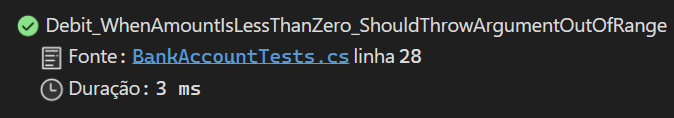

# Relatório de Testes de Unidade - Projeto "Bank"

## Resumo

Este relatório aborda o processo de criação, execução e análise de testes de unidade no contexto de um projeto de software desenvolvido em C#. Utilizamos o Visual Studio, uma IDE popular para desenvolvimento .NET, para criar um projeto simples chamado "Bank" e um projeto de teste de unidade associado. O objetivo é demonstrar a importância dos testes de unidade na verificação da lógica de negócios de aplicações de software de maneira automatizada.

## Tecnologia e ferramentas

- Linguagem de Programação: C#
- Ambiente de Desenvolvimento: Visual Studio
- Framework de Teste: Microsoft.VisualStudio.TestTools.UnitTesting

## Conceitos aprendidos

- **Testes de unidade:** Testes que validam a corretude de componentes individuais do código, como métodos de uma classe. São fundamentais para garantir a qualidade do software e facilitar a manutenção.
- **Asserts:** Afirmações usadas nos testes para verificar se o resultado obtido corresponde ao resultado esperado.
- **Tratamento de exceções nos testes:** Verificação de que o código sob teste lança as exceções esperadas em condições de erro.
- **IDE Visual Studio:** Uso do Visual Studio para desenvolvimento e teste de aplicações .NET.

## Desenvolvimento

Criamos um projeto chamado "Bank" contendo uma classe `BankAccount` com métodos para crédito e débito. Em seguida, criamos um projeto de teste de unidade para verificar a corretude desses métodos.

OBS: Não consegui subir o código no GitHub, portanto colei aqui. 

### Classe BankAccount

```csharp
using System;

namespace BankAccountNS
{
    /// <summary>
    /// Bank account demo class.
    /// </summary>
    public class BankAccount
    {
        public const string DebitAmountExceedsBalanceMessage = "Debit amount exceeds balance";
        public const string DebitAmountLessThanZeroMessage = "Debit amount is less than zero";

        private readonly string m_customerName;
        private double m_balance;

        private BankAccount() { }

        public BankAccount(string customerName, double balance)
        {
            m_customerName = customerName;
            m_balance = balance;
        }

        public string CustomerName
        {
            get { return m_customerName; }
        }

        public double Balance
        {
            get { return m_balance; }
        }

        public void Debit(double amount)
        {
            if (amount > m_balance)
            {
                throw new System.ArgumentOutOfRangeException("amount", amount, DebitAmountExceedsBalanceMessage);
            }

            if (amount < 0)
            {
                throw new System.ArgumentOutOfRangeException("amount", amount, DebitAmountLessThanZeroMessage);
            }

            m_balance -= amount;
        }

        public void Credit(double amount)
        {
            if (amount < 0)
            {
                throw new ArgumentOutOfRangeException("amount");
            }

            m_balance += amount;
        }

        public static void Main()
        {
            BankAccount ba = new BankAccount("Mr. Bryan Walton", 11.99);

            ba.Credit(5.77);
            ba.Debit(11.22);
            Console.WriteLine("Current balance is ${0}", ba.Balance);
        }
    }
}
```

### Classe de teste BankAccountTests

```csharp
[TestMethod]
public void Debit_WithValidAmount_UpdatesBalance()
// The 'using' statement for Test Tools is in GlobalUsings.cs
// using Microsoft.VisualStudio.TestTools.UnitTesting;
using BankAccountNS;

namespace BankTests
{
    [TestClass]
    public class BankAccountTests
    {

        [TestMethod]
        public void Debit_WhenAmountIsLessThanZero_ShouldThrowArgumentOutOfRange()
        {
            // Arrange
            double beginningBalance = 11.99;
            double debitAmount = -100.00;
            BankAccount account = new BankAccount("Mr. Bryan Walton", beginningBalance);

            // Act and assert
            Assert.ThrowsException<System.ArgumentOutOfRangeException>(() => account.Debit(debitAmount));
        }

        [TestMethod]
        public void Debit_WhenAmountIsMoreThanBalance_ShouldThrowArgumentOutOfRange()
        {
            // Arrange
            double beginningBalance = 11.99;
            double debitAmount = 20.0;
            BankAccount account = new BankAccount("Mr. Bryan Walton", beginningBalance);

            // Act
            try
            {
                account.Debit(debitAmount);
            }
            catch (System.ArgumentOutOfRangeException e)
            {
                // Assert
                StringAssert.Contains(e.Message, BankAccount.DebitAmountExceedsBalanceMessage);
                return;
            }

            Assert.Fail("The expected exception was not thrown.");
        }
    }
}
```

## Passo a passo resumido

1. **Criar um projeto para teste**: início com a criação de um projeto C# no Visual Studio, configurando um ambiente para o desenvolvimento de software.

2. **Implementar a classe a ser testada**: desenvolvimento de uma classe `BankAccount` com funcionalidades básicas de uma conta bancária, incluindo métodos para crédito e débito.

3. **Criar um projeto de teste de unidade**: configuração de um novo projeto no Visual Studio específico para os testes de unidade, utilizando o modelo de projeto de teste de unidade do MSTest.

4. **Desenvolver a classe de teste**: implementação de uma classe de teste `BankAccountTests` com métodos de teste para validar o comportamento da classe `BankAccount`, utilizando atributos como `[TestClass]` e `[TestMethod]` para indicar os testes.

5. **Escrever métodos de teste**: criação de métodos de teste específicos para verificar os comportamentos esperados dos métodos da classe `BankAccount`, como o tratamento de valores de débito válidos e inválidos.

6. **Executar e analisar os testes**: execução dos testes de unidade através do Gerenciador de Testes do Visual Studio, analisando os resultados para verificar se o código se comporta conforme esperado.

7. **Refatoração e melhoria do código**: ajustes no código da classe `BankAccount` e nos métodos de teste com base nos resultados obtidos, utilizando um processo iterativo de teste e refatoração para aprimorar tanto os testes quanto o código em teste.


## Execução dos testes

Os testes foram escritos para validar operações de débito e crédito, incluindo a verificação de exceções para valores inválidos.

### Captura de tela:

#### Compilando:


#### Testes falhando:


#### Testes passando:
1. Primeira execução com sucesso


2. Segunda execução com sucesso 


3. Testes

<br/>


<br/>


<br/>


